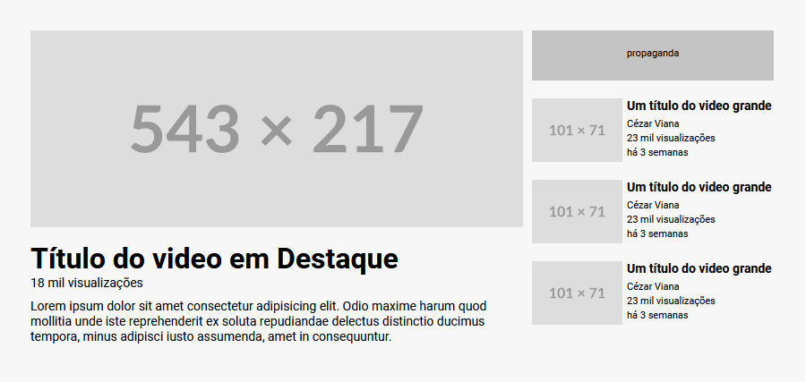

# Exercício de Grid (Layout YouTube)

Um projeto para testar o conhecimento de Git Bash, HTML e  CSS, principalmente Grid, em conjunto com Flexbox 🔥

O display Grid permite separar em áreas, como em um plano cartesiano. Assim, pode facilitar o layout de sites.

## Descrição da tarefa
O desafio é criar um layout similar ao do YouTube. Para aprimorar as habilidades de posicionamento de elementos usando display Grid.

### Font family para ser usada no projeto:

- Family: [Roboto](https://fonts.google.com/specimen/Roboto)
- Weights: 400, 800

### Cores
***
--background-color: #F7F7F7;  
--text-color: black;
***

## Imagens do Design criado

 

## Tecnologias utilizadas
- HTML
- CSS
- Git Bash

### Como utilizar

1 - Clone o projeto
***
git clone <https://github.com/cezarviana/layout-youtube-com-grid.git>
***

